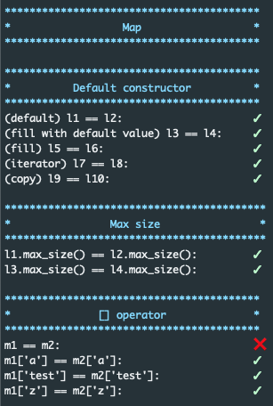

# ft_containers
## Research
- http://www.cplusplus.com/reference/stl/
- https://thispointer.com/difference-between-vector-and-list-in-c/
- https://www.youtube.com/watch?v=qvZGUFHWChY
- https://www.geeksforgeeks.org/difference-between-stack-and-queue-data-structures/
## How does containers work?
### list
List works with a double linked-list.
### vector
Vector work with a dynamic array: new T[size].
_container is the array containing objects.
_container_size is the size of _container in memory.
_container_length is the number of elements in the array.
### map
Map is an associative array (key => value). It cannot have two pairs with the same key.
We can use std::pair to store a pair key/value.
It's implemented using a binary search tree.
The difficulty here could be the end() iterator. You need to come back in the tree with --end(), so a NULL pointer may not be sufficient.

My solution was to create a binary tree like that:
```
    (root)
    /     \
  (tree) (end())
         /
      (tree)
```
So end() is always the biggest value in the tree.

Another tricky part is to find the successor of a node in the tree.
You can search for "successor / predecessor in binary search tree".

### stack
Stack is a LIFO container. It can be built with other containers, such as list.
We'll use a private property that will be a container (list by default), but it can be specified during instanciation.
### queue
Queue is a FIFO container. As stack, we'll use an other container specified during instanciation to build it.
## Tools
You can find in tools/ a script to get a fresh todo list, directly constructed from cplusplus.com.
## Tests
You can copy/paste the tests folder inside your project. Edit the tests.hpp includes to your actual header files.
Then you can compile all the cpp files inside the folder.
I strongly advise you to compile with -fsantize=address -g3 on Linux to check leaks.
```sh
./a.out vector
./a.out list
./a.out map
./a.out queue
./a.out stack
```
You will have a formatted list of unit tests:

## Compile the project
```sh
make vector
make list
make map
make queue
make stack
```